<p align="center">
	
</p>
<h1 align="center" style="margin: 30px 0 30px; font-weight: bold;">Lucky-Admin-Vue</h1>
<h4 align="center">基于SpringBoot3+Vue2前后端分离的快速开发后台的框架</h4>
<p align="center">
	<a href="https://gitee.com/xiaodu6/lucky-admin-vue/stargazers"></a>
</p>

## 项目介绍
Lucky-Admin-Vue是一个基于SpringBoot3+Vue2前后端分离的快速开发后台的框架，采用前后端分离方式，集成了用户管理、菜单管理、角色管理、日志管理、操作日志、登录日志、代码生成、系统接口、在线用户、服务监控、缓存管理、文件上传、文件下载等功能模块。
## 开发环境
- JDK 17
- MySQL 8.0+
- Node 18.20.5+
- Vue 2
- SpringBoot 3.4.1
- Mybatis-plus 3.5.10.1
- Springdoc OpenAPI 2.7.0
## 后端目录结构
```
main
├─config            ## 全局配置
├─exception         ## 全局异常处理
├─gen               ## 代码生成相关
│  ├─config         ## 代码生成配置
│  └─service        ## 代码生成接口
│      └─impl       ## 代码生成接口实现
├─system            ## 系统管理相关
│  ├─annotation     ## 自定义注解
│  ├─aspectj        ## 切面
│  ├─base           ## 基础类
│  │  └─controller  ## 控制器
│  ├─config         ## 系统配置
│  ├─constant       ## 系统常量
│  ├─controller     ## 控制器
│  ├─enums          ## 枚举
│  ├─filter         ## 过滤器
│  ├─manager        ## 管理类
│  │  └─factory     ## 工厂
│  ├─mapper         ## 数据层
│  ├─pojo           ## 实体类
│  ├─service        ## 业务层
│  │  └─impl        ## 业务层实现
│  └─vo             ## 视图对象
├─utils             ## 工具类
└─vo                ## 视图对象
```
## 前端目录结构
```
main
├─api               ## 接口
├─assets            ## 静态资源
├─components        ## 组件
├─directive         ## 指令
├─icons             ## 图标
│  └─svg            ## svg图标
├─layout            ## 布局
├─router            ## 路由
├─store             ## 状态管理
├─styles            ## 样式
├─utils             ## 工具类
└─views             ## 页面

```
## 快速开始
1. 克隆项目到本地
2. 修改数据源配置
3. 执行sql文件
4. 运行项目

## 待优化内容
1. 菜单支持添加内链iFrame
2. 集成Excel导入导出
3. 集成文件管理系统(本地、七牛云...)
4. 集成定时任务系统
5. 微信小程序开发

## 项目截图
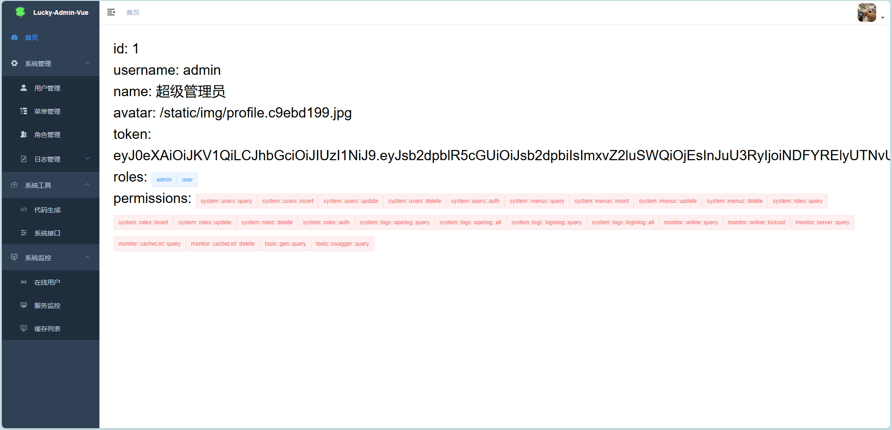
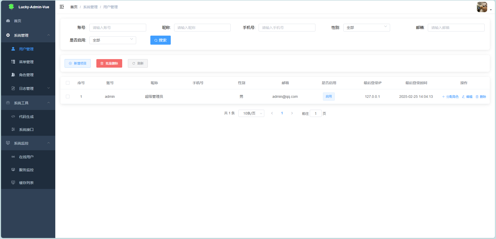
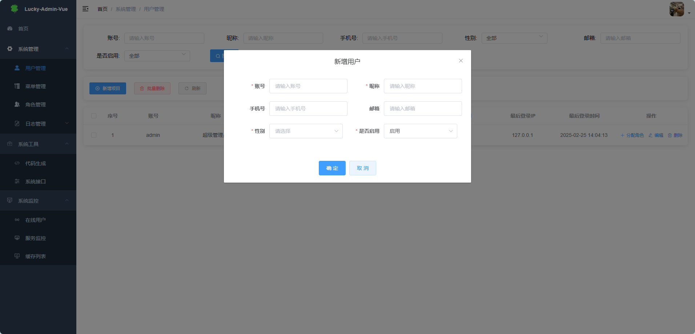
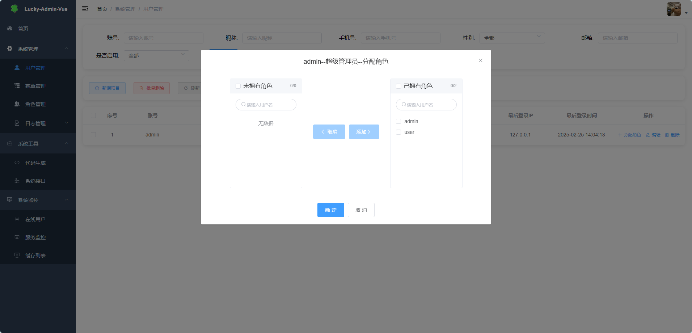
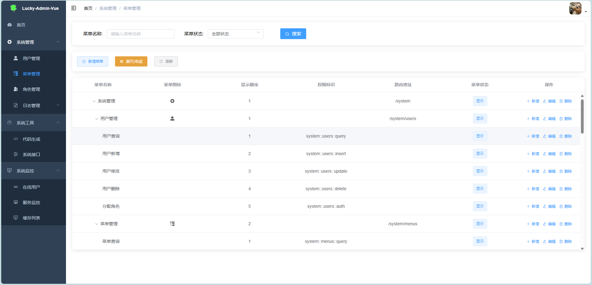
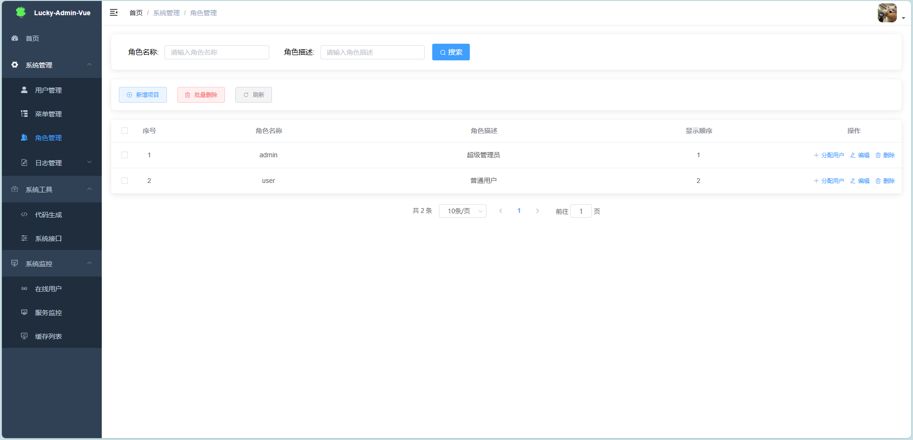
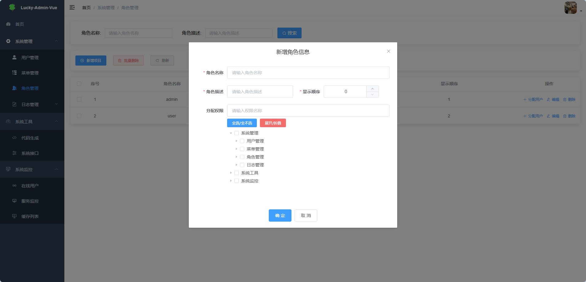
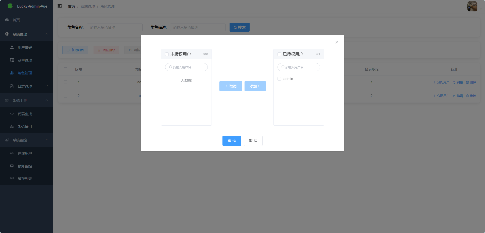
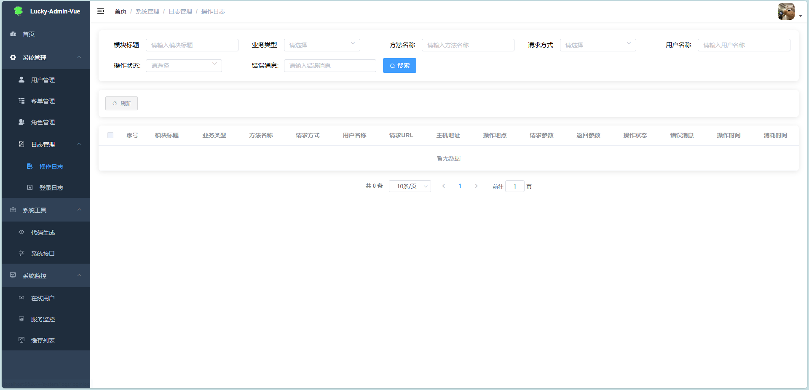
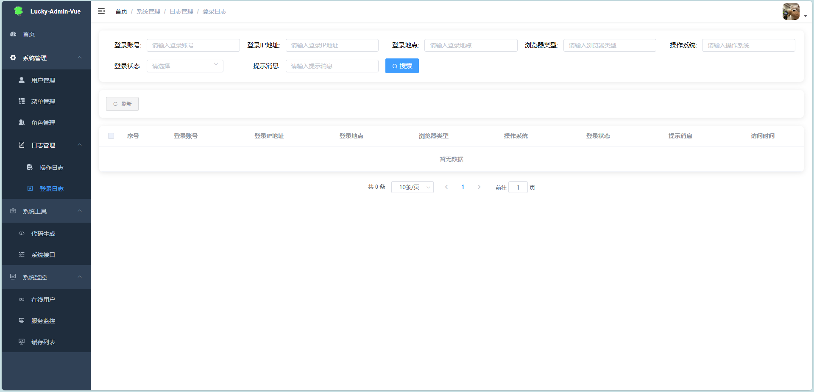
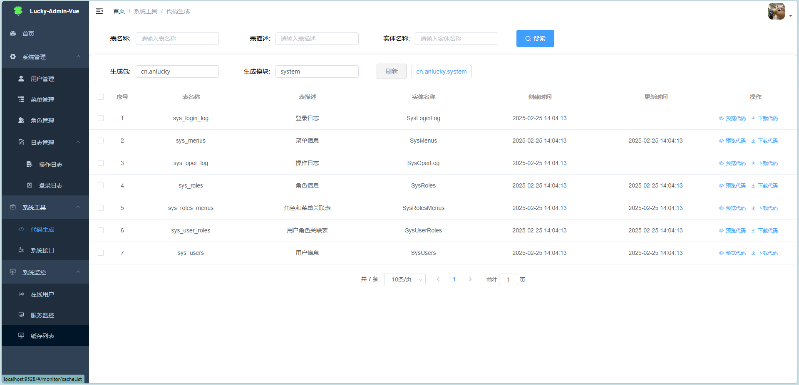
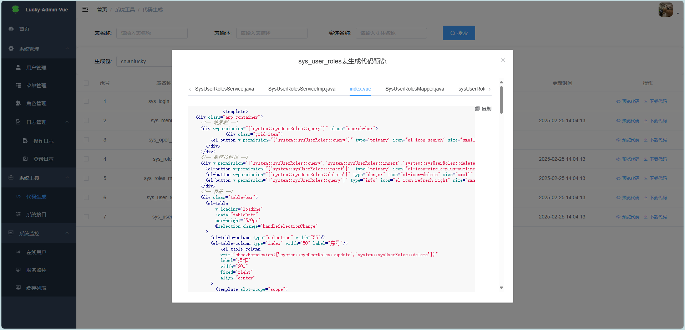
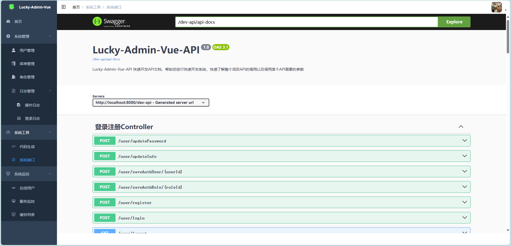
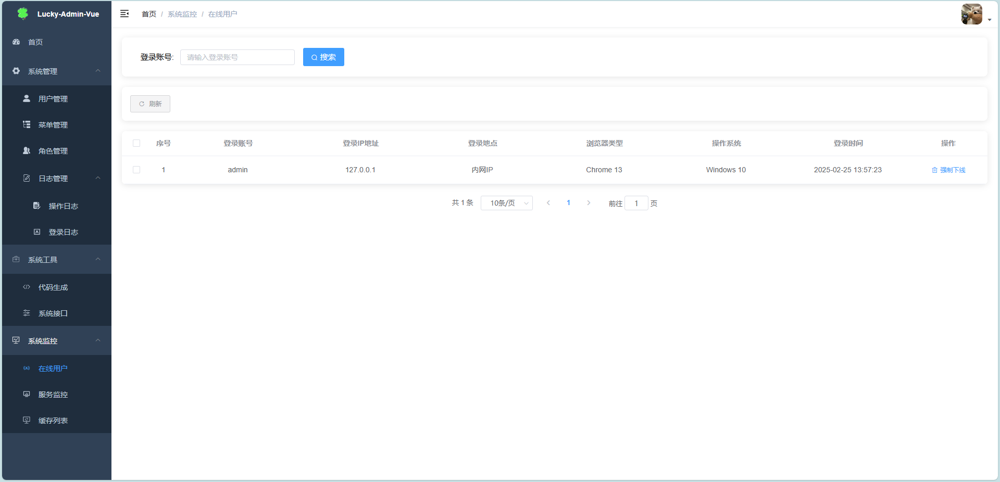
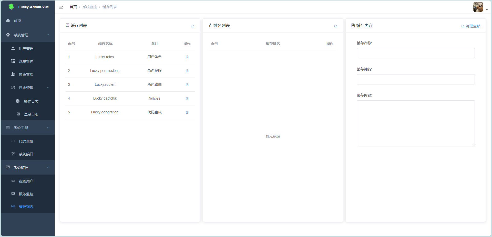
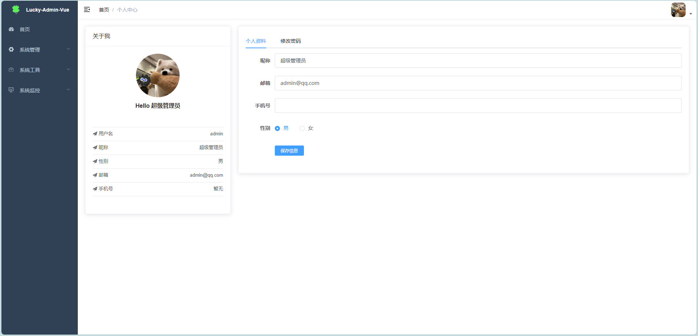

## 致谢
框架中许多思路构建来源于若依框架，感谢原作者。

## BUG交流QQ群
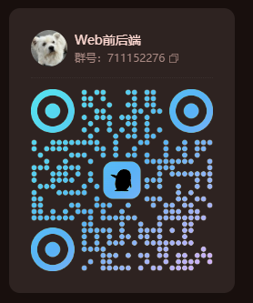

## 常见问题？
